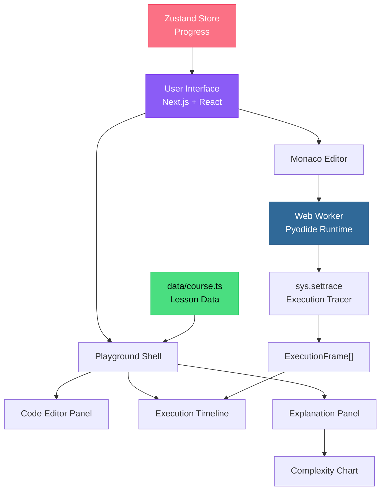
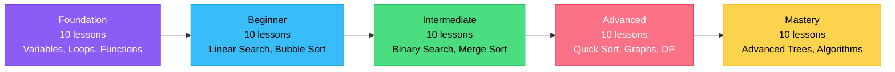
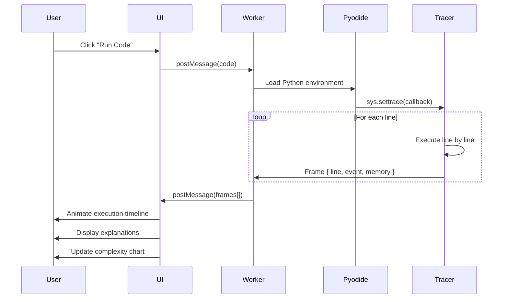

# 🐍 PyAnimate

**Master algorithms through interactive Python execution in your browser**

[](https://nextjs.org/)
[](https://www.typescriptlang.org/)
[](https://tailwindcss.com/)
[](https://pyodide.org/)
[](https://opensource.org/licenses/MIT)

---

PyAnimate is a **browser-based Python learning playground** that brings algorithms to life through interactive execution visualization. Watch your code run line-by-line, explore complexity analysis with interactive charts, and master 50 carefully curated algorithms from foundation to mastery level—all without ever leaving your browser.

Perfect for students, interview prep, visual learners, and anyone who wants to truly *understand* how algorithms work, not just memorize them.

---

## ✨ Features

- 🎓 **50 Interactive Lessons** — Structured progression across 5 levels (Foundation → Beginner → Intermediate → Advanced → Mastery)
- 🐍 **Real Python Execution** — Full Python 3.11 runtime powered by Pyodide WebAssembly (no backend required!)
- 🔍 **Step-by-Step Execution Frames** — Watch code execute line-by-line with educational explanations for each step
- 📊 **Interactive Big O Complexity Visualization** — Explore time/space complexity with dynamic charts showing operation counts at different input sizes
- 💻 **Monaco Editor Integration** — Professional code editing with syntax highlighting, IntelliSense, and error detection
- 🌙 **Beautiful Dark Theme** — Eye-friendly dark UI with vibrant accent colors and smooth Framer Motion animations
- 🏆 **Progress Tracking** — Earn XP, maintain learning streaks, and track completed lessons (persisted locally)
- 📚 **Groupable Lesson Queue** — Organize your learning journey by level with expandable sections
- ⚡ **100% Client-Side** — No backend, no login, no tracking—works offline after first load
- 🎨 **Responsive Design** — Seamless experience across desktop, tablet, and mobile devices

---

## 🛠️ Tech Stack

| Category | Technology |
|----------|-----------|
| **Framework** | Next.js 15 (App Router) |
| **Language** | TypeScript 5.0 |
| **Styling** | Tailwind CSS v3 |
| **Python Runtime** | Pyodide 0.26.4 (WebAssembly) |
| **Code Editor** | Monaco Editor |
| **Animations** | Framer Motion |
| **State Management** | Zustand (with persist middleware) |
| **Icons** | Lucide React |
| **UI Components** | Custom components with Radix UI primitives |

---

## 🏗️ Architecture

PyAnimate leverages a modular architecture that separates concerns between the UI layer, code execution environment, and educational content delivery.



**Key Components:**
- **User Interface Layer** — React components orchestrate the learning experience
- **Monaco Editor** — Provides professional code editing capabilities
- **Playground Shell** — Main container coordinating editor, timeline, and explanations
- **Web Worker** — Isolates Python execution to prevent UI blocking
- **Execution Tracer** — Captures line-by-line execution via Python's `sys.settrace`
- **Lesson Data Store** — Centralized repository of all algorithm lessons
- **Progress Store** — Persists user achievements and learning history

---

## 📚 Learning Journey

Master algorithms through a carefully structured curriculum that builds foundational knowledge and progressively introduces advanced concepts.



**Curriculum Highlights:**
- **Foundation** — Master Python basics (print, variables, conditionals, loops, functions)
- **Beginner** — Learn fundamental algorithms (linear search, bubble sort, selection sort)
- **Intermediate** — Explore efficient techniques (binary search, merge sort, recursion)
- **Advanced** — Tackle complex problems (quick sort, graph traversal, dynamic programming)
- **Mastery** — Conquer advanced data structures (heaps, segment trees, advanced DP)

---

## ⚙️ Execution Pipeline

Understanding how PyAnimate executes your code helps you appreciate the magic behind the visualization.



**Pipeline Stages:**

1. **User Interaction** — User clicks "Run Code" in the playground
2. **Message Passing** — UI sends code to dedicated Web Worker
3. **Environment Setup** — Pyodide initializes Python 3.11 runtime
4. **Trace Registration** — `sys.settrace()` hooks into execution flow
5. **Line-by-Line Execution** — Tracer captures every line, variable state, and event
6. **Frame Collection** — Each execution step becomes an `ExecutionFrame` object
7. **UI Update** — Frames stream back to UI for animated visualization
8. **Educational Display** — Timeline animates, explanations highlight, charts update

---

## 🚀 Installation & Setup

Get PyAnimate running locally in under 2 minutes:

```bash
# Clone the repository
git clone https://github.com/UpadhyayAmit/PyAnimate.git
cd PyAnimate

# Install dependencies
npm install

# Run development server
npm run dev

# Open your browser
# Navigate to http://localhost:3000
```

**Build for Production:**

```bash
# Create optimized production build
npm run build

# Start production server
npm start

# Or export static site
npm run build && npm run export
```

**Requirements:**
- Node.js 18.17 or higher
- npm 9.0 or higher
- Modern browser with WebAssembly support

---

## 📁 Project Structure

```
PyAnimate/
├── app/                          # Next.js 15 App Router
│   ├── page.tsx                 # Homepage with feature showcase
│   ├── layout.tsx               # Root layout with providers
│   ├── playground/              # Interactive playground routes
│   │   └── page.tsx            # Main playground interface
│   └── tracks/                  # Algorithm track pages
│       └── [level]/
│           └── page.tsx         # Level-specific lesson browser
├── components/                   # React components
│   ├── playground-shell.tsx     # Main playground container
│   ├── complexity-chart.tsx     # Interactive Big O visualization
│   ├── monaco-editor.tsx        # Code editor wrapper
│   ├── execution-timeline.tsx   # Step-by-step frame display
│   ├── lesson-card.tsx          # Lesson preview cards
│   ├── progress-tracker.tsx     # XP and streak display
│   └── ui/                      # Reusable UI components
├── data/
│   └── course.ts                # All 50 lesson definitions
├── lib/
│   ├── use-pyodide.ts           # Pyodide Web Worker hook
│   ├── use-progress.ts          # Zustand progress store
│   ├── types.ts                 # TypeScript type definitions
│   └── utils.ts                 # Utility functions
├── public/
│   ├── pyodide-worker.js        # Web Worker for Python execution
│   └── assets/                  # Static assets
├── styles/
│   └── globals.css              # Global styles and Tailwind directives
├── tailwind.config.ts           # Tailwind configuration
├── next.config.ts               # Next.js configuration
├── tsconfig.json                # TypeScript configuration
└── package.json                 # Project dependencies
```

---

## 🎯 Use Cases & Educational Value

### Who is PyAnimate For?

**📖 Students Learning Algorithms**
- Visual learners who need to *see* how code executes, not just read about it
- Step-by-step explanations demystify complex algorithmic concepts
- Progress tracking provides motivation and clear learning milestones

**💼 Interview Preparation**
- Practice classic algorithms asked in technical interviews (sorting, searching, DP)
- Understand time/space complexity through interactive visualization
- Build muscle memory by editing and running code repeatedly

**🎨 Visual Learners**
- Watch variables change in real-time as code executes
- See memory allocation and deallocation visually
- Understand recursion through frame-by-frame execution

**👨‍🏫 Educators**
- Use as a teaching tool in computer science courses
- Share lessons with students (no login required)
- Demonstrate algorithmic concepts interactively during lectures

**🏃 Self-Paced Learners**
- No backend means no account creation, no tracking, no friction
- Learn offline after initial load (Progressive Web App capabilities)
- Flexible lesson order—skip ahead or revisit fundamentals anytime

---

## 💡 Design Decisions

### Why Pyodide?
Running real Python in the browser eliminates server costs, enables instant feedback, and works offline. Students get an authentic Python experience without environment setup headaches.

### Why Pre-Computed Execution Frames?
Rather than real-time tracing (which can be unpredictable), lessons include curated execution frames. This ensures a consistent, educational experience where every frame includes context-aware explanations.

### Why Next.js App Router?
- **Static Generation** — Lightning-fast page loads with SSG
- **Server Components** — Optimal bundle sizes by default
- **Modern Patterns** — Embraces React's latest features (Suspense, streaming)
- **Developer Experience** — Hot reload, TypeScript support, zero config

### Why Dark Theme?
Developer tools overwhelmingly favor dark themes to reduce eye strain during extended learning sessions. The vibrant accent colors (purple, cyan, pink) provide visual hierarchy without brightness fatigue.

### Why 50 Lessons?
Comprehensive coverage from absolute basics (`print()`, variables) to advanced topics (segment trees, advanced DP) ensures learners can start from zero and reach interview-ready competence.

### Why Zustand?
Lightweight state management (3kb) with built-in persistence middleware. No boilerplate, no Redux complexity—just reactive stores that survive page refreshes.

---

## 📊 Complexity Visualization

One of PyAnimate's standout features is the **Interactive Complexity Chart** that makes Big O notation tangible.

### Features:

- **Visual Curves** — See O(1), O(log n), O(n), O(n log n), O(n²), O(2ⁿ) plotted on dynamic charts
- **Current Algorithm Highlight** — The lesson's complexity curve is emphasized with vibrant colors
- **Interactive Slider** — Adjust input size `n` and watch operation counts update in real-time
- **Comparative Analysis** — Understand *why* O(n²) is slower than O(n log n) by comparing curves
- **Practical Examples** — Each complexity includes real-world scenarios (e.g., "sorting a deck of cards")

**Example:**
When learning Merge Sort (O(n log n)), the chart shows:
- At n=100: ~664 operations
- At n=1000: ~9,966 operations
- At n=10,000: ~132,877 operations

Compare this to Bubble Sort (O(n²)):
- At n=100: 10,000 operations (15x slower!)
- At n=1000: 1,000,000 operations (100x slower!)

This visceral understanding helps learners make informed algorithm choices in real projects.

---

## 🗺️ Roadmap

Future enhancements we're exploring:

- [ ] **User-Created Custom Lessons** — Let educators create and share lessons
- [ ] **Social Sharing** — Share code solutions with unique URLs
- [ ] **Leaderboards & Achievements** — Gamify learning with badges and rankings
- [ ] **Multi-Language Support** — Add JavaScript, Java, C++, Rust execution
- [ ] **Video Walkthroughs** — Embedded explanations for complex algorithms
- [ ] **Collaborative Mode** — Real-time pair programming with friends
- [ ] **Mobile App** — Native iOS/Android apps for learning on-the-go
- [ ] **AI Hints** — Context-aware suggestions when learners get stuck
- [ ] **Code Challenges** — Timed coding challenges with automated testing
- [ ] **Export Progress** — Download certificates and learning transcripts

---

## 🤝 Contributing

We welcome contributions from the community! Whether it's bug fixes, new lessons, UI improvements, or documentation updates—your help makes PyAnimate better for everyone.

### How to Contribute:

1. **Fork the repository**
2. **Create a feature branch** (`git checkout -b feature/amazing-lesson`)
3. **Make your changes** (follow existing code style)
4. **Test thoroughly** (`npm run build` should succeed)
5. **Commit with clear messages** (`git commit -m 'Add Quick Select algorithm'`)
6. **Push to your fork** (`git push origin feature/amazing-lesson`)
7. **Open a Pull Request** with detailed description

### Areas We Need Help:

- 📝 Additional algorithm lessons (graph algorithms, advanced DP, etc.)
- 🐛 Bug reports and fixes
- 🎨 UI/UX improvements and accessibility
- 📖 Documentation improvements
- 🌍 Internationalization (i18n) support
- ⚡ Performance optimizations

### Code Style:

- Use TypeScript for all new code
- Follow existing formatting (Prettier config included)
- Write descriptive variable names
- Add comments for complex logic
- Include JSDoc for exported functions

---

## 📄 License

PyAnimate is open source software licensed under the **MIT License**. See the [LICENSE](LICENSE) file for details.

---

## 🙏 Acknowledgments

PyAnimate stands on the shoulders of giants. Massive thanks to:

- **[Pyodide Team](https://pyodide.org/)** — For making Python in the browser possible
- **[Monaco Editor](https://microsoft.github.io/monaco-editor/)** — VS Code's editor in the browser
- **[Next.js Team](https://nextjs.org/)** — For the incredible React framework
- **[Tailwind CSS](https://tailwindcss.com/)** — For utility-first styling that just works
- **[Framer Motion](https://www.framer.com/motion/)** — For buttery-smooth animations
- **[Zustand Maintainers](https://github.com/pmndrs/zustand)** — For elegant state management
- **[Lucide Icons](https://lucide.dev/)** — For beautiful, consistent iconography
- **Algorithm Educators Worldwide** — For inspiring the next generation of developers

---

## 🌟 Star History

If PyAnimate helps you learn algorithms, please consider giving it a ⭐ on GitHub! It helps others discover the project.

---

**Built with ❤️ by developers who believe learning algorithms should be visual, interactive, and fun.**

*Happy Learning! 🚀*
